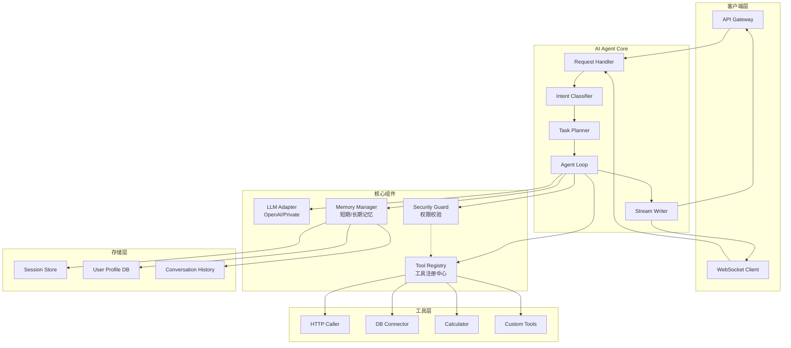

# AI Agent System based on Eino Framework

## 系统架构图



## 核心模块说明

### 1. LLM Adapter (大模型适配层)
- 抽象不同大模型后端的接口差异
- 支持 OpenAI、私有化模型等多种后端
- 统一流式输出格式

### 2. Tool Registry (工具注册中心)
- 动态注册和管理工具
- 工具元数据管理（名称、描述、参数 schema）
- 权限校验拦截器

### 3. Memory Manager (记忆管理器)
- 短期记忆：当前会话的上下文窗口管理
- 长期记忆：用户偏好、历史摘要的持久化
- 记忆压缩和检索策略

### 4. Security Guard (安全守卫)
- 工具调用权限校验
- 注入攻击检测
- 越权操作拦截

### 5. Agent Loop (智能体主循环)
- ReAct 模式实现
- 思考-行动-观察循环
- 错误处理和重试机制

---

## 目录结构

```
ai-agent-system/
├── cmd/
│   └── server/
│       └── main.go          # 程序入口
├── internal/
│   ├── agent/
│   │   ├── agent.go         # Agent 主循环
│   │   ├── planner.go       # 任务规划器
│   │   └── classifier.go    # 意图识别
│   ├── components/
│   │   ├── llm/
│   │   │   ├── adapter.go   # LLM 适配器接口
│   │   │   ├── openai.go    # OpenAI 实现
│   │   │   └── private.go   # 私有模型实现
│   │   ├── tool/
│   │   │   ├── registry.go  # 工具注册中心
│   │   │   └── base.go      # 工具基础接口
│   │   └── memory/
│   │       ├── manager.go   # 记忆管理器
│   │       └── store.go     # 存储接口
│   ├── security/
│   │   └── guard.go         # 安全守卫
│   └── api/
│       └── handler.go       # HTTP 处理器
├── pkg/
│   └── types/
│       └── message.go       # 消息类型定义
└── go.mod
```
